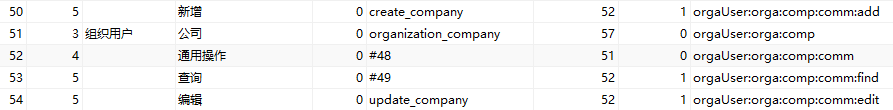

###feignClient请求验参方式:(服务提供方在controller层调用)
CheckUrlSignUtil.checkFeignSign(getRequest()); 
###user端接口权限校验说明
为用户端提供的接口，需要在代码中校验用户是否有对应的数据操作权限,权限标识与wd_sys_menu中的标识一一对应，如：  
ShiroUtils.checkPerm("orgaUser:orga:comp:comm:edit",existCompany.getId());  
ShiroUtils.checkPerm(Constant.MenuDefine.BUSINESS_UNIT_UPDATE, businessUnitDto.getCompanyId());

####批量操作时过滤掉无权限数据
ShiroUtils.filterNotPermData(List<T> checkPermList,String menuDefine,CheckPermSupport<T> checkPermSupport);
```
@checkPermList    待过滤权限的数据列表
@menuDefine       权限定义,如"ledgerManage:voucMain:list:comm:delete"
@checkPermSupport 提供两个方法的实现,用于从单条数据中获取ID和公司ID
```

###admin端接口权限校验说明
校验业务管理员/租户管理员：  
ShiroUtils.checkRole(Constant.ShiroAdminDefi.BUSINESS_ADMIN, operator.getRootEnterpriseId());

##业务数据引用说明
部分业务模块的业务数据在删除等操作前需要先判断是否被别的业务模块引用，被引用则不能被删除，并返回被引用情况，未被引用则正常删除。
暂时需要检测引用的业务模块为公司、业务单元、岗位权限、核算账簿、核算主体、会计科目、现金流量项目、部门、员工、自定义辅助核算项目。
示例如下：
```
public String delete(List<Long> ids){
    ReferenceContext referenceContext = referenceRelationService.isReference(Constant.Reference.COMPANY,ids);
    //未被引用的ID
    if(!referenceContext.getNotReferences().isEmpty()){
        //批量删除数据
    }
    //被引用的ID及说明
    if(!referenceContext.getReferences().isEmpty()){
        //返回不能删除数据及原因
        return null;
    }
    return null;
}
```

##相关文档
* [excel导入导出说明](/mdImg/EXCEL.md)

##返回ResultCode
结账：  
```
    无访问权限：10003 无访问权限
    系统异常：30062 结账异常，请尝试重新结账，如仍无法结账，请联系管理员处理！
    无需结账：30006 会计期间已结账，无需结账！
    不可结账：30064 %s年第%s期未结账，%s年第%s期不可结账
    结账校验：32003 checkFlag=true 结账校验不通过
    结账成功：200 checkFlag=false
```
反结账：
```
    无访问权限：10003 无访问权限
    禁止反结账：32002 “参数选项-允许反结账”未勾选，不允许进行反结账操作
    系统异常：30063 反结账异常，请尝试重新反结账，如仍无法反结账，请联系管理员处理！
    无需反结账：30061 会计期间未结账，无需反结账！
    不可反结账：30065 %s年第%s期已结账，%s年第%s期不可反结账
    反结账成功：200
```

